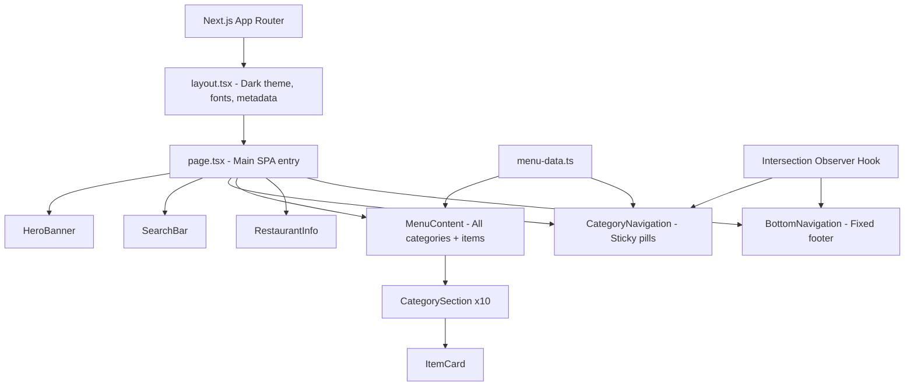
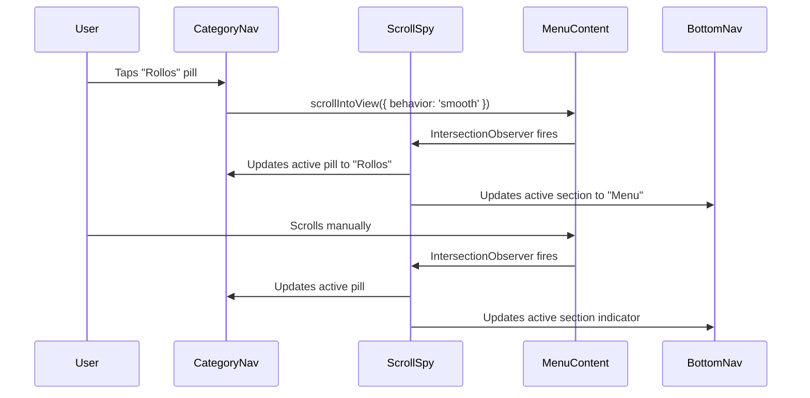

# Design Document: Sushi Menu SPA

## Overview

The Panko Sushi Menu SPA is a mobile-first digital menu application built with Next.js (App Router), TypeScript, and Tailwind CSS. It serves as a QR-scannable menu for customers dining at Panko Sushi in Mérida, Yucatán.

The application follows a static data architecture — all menu content lives in a TypeScript data file, eliminating the need for a backend. The UI is inspired by NordQR-style digital menus but improves upon them with smoother animations, better visual hierarchy, scroll-spy category navigation, and a refined organic/editorial aesthetic using the Panko Sushi brand palette.

### Brand Identity & Visual System

**Color Palette:**

| Token | Hex | Usage |
|-------|-----|-------|
| `--color-background` | `#F7F4F1` | Page background (warm off-white) |
| `--color-text-primary` | `#000002` | Body text, headings |
| `--color-accent-pink` | `#ECAFB6` | Soft accent, active states, highlights |
| `--color-accent-sage` | `#B8C59A` | Secondary accent, category pills, badges |
| `--color-accent-olive` | `#546942` | CTA buttons, strong interactive elements |
| `--color-accent-warm` | `#DB9C66` | Warm details, price highlights, borders |
| `--color-surface` | `#FFFFFF` | Card backgrounds, elevated surfaces |

**Typography:**

| Role | Font | Weight | Usage |
|------|------|--------|-------|
| Display / Headings | Catamaran | 700, 800 | Category headings, hero title, section titles |
| Body / UI | Avenir Next (fallback: system-ui, sans-serif) | 400, 500, 600 | Item names, descriptions, navigation, prices |

**Visual Style:** Organic, minimalist, editorial — warm tones with botanical accents. The aesthetic is sophisticated yet approachable, aligned with the restaurant's playful Shiba Inu branding.

### Key Design Decisions

1. **Static export with Next.js App Router** — Since there's no dynamic data, the app can be statically generated for maximum performance. All pages are server-rendered at build time.
2. **Motion library for animations** — Using `motion` (formerly Framer Motion) for declarative scroll-triggered animations and gesture support, with `prefers-reduced-motion` respect built in.
3. **Intersection Observer for scroll-spy** — Native browser API for tracking which category section is in view, updating the active pill in the category navigation.
4. **Single-page scroll architecture** — All content lives on one page. Navigation scrolls to sections rather than routing between pages.
5. **Client Components for interactivity** — The main menu page uses `"use client"` for scroll handling, search state, and animations. Data is imported statically.

### Technology Stack

| Layer | Technology |
|-------|-----------|
| Framework | Next.js 16 (App Router) |
| Language | TypeScript (strict mode) |
| Styling | Tailwind CSS 4 |
| Animations | Motion (motion/react) |
| State | React useState/useRef (no external state library) |
| Data | Static TypeScript file |
| Package Manager | pnpm |

## Architecture



### Rendering Strategy

- **Build-time static generation** — `page.tsx` is a Client Component that imports static data. Next.js pre-renders the HTML at build time.
- **No API routes** — All data is embedded in the bundle.
- **No SSR data fetching** — Menu data is a direct TypeScript import.

### Scroll Architecture



## Components and Interfaces

### Component Tree

```
App (layout.tsx)
└── MenuPage (page.tsx) [Client Component]
    ├── HeroBanner
    │   ├── Logo (Next/Image)
    │   ├── Restaurant name + tagline
    │   └── Quick info (hours, phone, address)
    ├── SearchBar
    ├── CategoryNavigation
    │   └── CategoryPill[] (horizontally scrollable)
    ├── MenuContent
    │   └── CategorySection[]
    │       ├── Category heading + description
    │       └── ItemCard[]
    │           ├── Item name
    │           ├── Item description
    │           └── Price / ProteinOptions
    ├── RestaurantInfo
    │   ├── Phone link (tel:)
    │   ├── Address link (maps)
    │   ├── Instagram link
    │   └── Business hours
    └── BottomNavigation
        ├── Home button
        ├── Menu button
        └── Contact button
```

### Component Interfaces

```typescript
// HeroBanner
interface HeroBannerProps {
  logoSrc: string;
  restaurantName: string;
  tagline: string;
  hours: string;
  phone: string;
  address: string;
}

// CategoryNavigation
interface CategoryNavigationProps {
  categories: Category[];
  activeCategory: string;
  onCategorySelect: (categoryId: string) => void;
}

// SearchBar
interface SearchBarProps {
  value: string;
  onChange: (value: string) => void;
  resultCount: number;
  isActive: boolean;
}

// CategorySection
interface CategorySectionProps {
  category: Category;
  searchQuery: string;
}

// ItemCard
interface ItemCardProps {
  item: MenuItem;
}

// BottomNavigation
interface BottomNavigationProps {
  activeSection: 'home' | 'menu' | 'contact';
  onNavigate: (section: 'home' | 'menu' | 'contact') => void;
}

// RestaurantInfo
interface RestaurantInfoProps {
  phone: string;
  address: string;
  addressUrl: string;
  instagram: string;
  instagramUrl: string;
  hours: string;
}
```

### Custom Hooks

```typescript
// useScrollSpy - Tracks which category section is in view
function useScrollSpy(sectionIds: string[]): string;

// useDebounce - Debounces search input (300ms)
function useDebounce<T>(value: T, delay: number): T;
```

### File Structure

```
src/
├── app/
│   ├── layout.tsx          # Root layout (dark theme, fonts, metadata)
│   ├── page.tsx            # Main SPA page (Client Component)
│   ├── globals.css         # Tailwind imports + custom CSS variables
│   └── favicon.ico
├── components/
│   ├── HeroBanner.tsx
│   ├── SearchBar.tsx
│   ├── CategoryNavigation.tsx
│   ├── CategorySection.tsx
│   ├── ItemCard.tsx
│   ├── RestaurantInfo.tsx
│   ├── BottomNavigation.tsx
│   └── AnimatedSection.tsx  # Wrapper for scroll-triggered animations
├── data/
│   └── menu-data.ts        # Static menu data + TypeScript types
├── hooks/
│   ├── useScrollSpy.ts
│   └── useDebounce.ts
└── lib/
    └── search.ts           # Search/filter logic (pure function)
```

## Data Models

### TypeScript Interfaces

```typescript
/** A protein option with its own price */
export interface ProteinOption {
  name: string;        // e.g., "Pollo", "Arrachera", "Camarón"
  price: number;       // Price in MXN as integer (e.g., 120)
}

/** A single menu item */
export interface MenuItem {
  id: string;                      // Unique identifier (slug)
  name: string;                    // Display name
  description?: string;            // Optional description (max 200 chars)
  price?: number;                  // Base price in MXN (omitted if protein options exist)
  proteinOptions?: ProteinOption[]; // Protein variants with individual prices
}

/** A menu category grouping items */
export interface Category {
  id: string;                // Unique identifier (slug)
  name: string;              // Display name (e.g., "Rollos")
  displayOrder: number;      // Sort order
  description?: string;      // Category description (e.g., base ingredients)
  items: MenuItem[];         // Items in this category
}

/** Complete menu data structure */
export interface MenuData {
  categories: Category[];
  restaurant: RestaurantData;
}

/** Restaurant metadata */
export interface RestaurantData {
  name: string;
  tagline: string;
  phone: string;
  address: string;
  addressUrl: string;
  instagram: string;
  instagramUrl: string;
  hours: string;
  logoSrc: string;
}
```

### Data File Example

```typescript
// src/data/menu-data.ts
import { MenuData } from './types';

export const menuData: MenuData = {
  restaurant: {
    name: "Panko Sushi",
    tagline: "Sushi artesanal en Mérida, Yucatán",
    phone: "9811695143",
    address: "Calle 14a #18, Colonia Prado entre 36 y Montecristo",
    addressUrl: "https://maps.google.com/?q=Calle+14a+18+Colonia+Prado+Merida",
    instagram: "@pankosushi24",
    instagramUrl: "https://instagram.com/pankosushi24",
    hours: "Lunes a Sábado de 6:30-11:00pm",
    logoSrc: "/PAKO SUSHI LOGO.png",
  },
  categories: [
    {
      id: "entradas",
      name: "Entradas",
      displayOrder: 1,
      items: [
        { id: "edamames", name: "Edamames", price: 60 },
        // ...
      ]
    },
    {
      id: "rollos",
      name: "Rollos",
      displayOrder: 2,
      description: "Base: arroz, queso crema, aguacate",
      items: [
        {
          id: "panko-roll",
          name: "Panko Roll",
          description: "Empanizado con panko crujiente",
          proteinOptions: [
            { name: "Pollo", price: 120 },
            { name: "Arrachera", price: 140 },
            { name: "Camarón", price: 150 },
          ]
        },
        // ...
      ]
    },
    // ... remaining categories
  ]
};
```

### Search Logic (Pure Function)

```typescript
// src/lib/search.ts
export interface SearchResult {
  category: Category;
  items: MenuItem[];
}

export function searchMenu(
  categories: Category[],
  query: string
): SearchResult[] {
  const normalizedQuery = query.toLowerCase().trim();
  if (!normalizedQuery) return categories.map(c => ({ category: c, items: c.items }));

  return categories
    .map(category => ({
      category,
      items: category.items.filter(item =>
        item.name.toLowerCase().includes(normalizedQuery) ||
        (item.description?.toLowerCase().includes(normalizedQuery) ?? false) ||
        (item.proteinOptions?.some(p =>
          p.name.toLowerCase().includes(normalizedQuery)
        ) ?? false)
      )
    }))
    .filter(result => result.items.length > 0);
}

export function countSearchResults(results: SearchResult[]): number {
  return results.reduce((sum, r) => sum + r.items.length, 0);
}
```


### Price Formatting (Pure Function)

```typescript
// src/lib/format.ts
export function formatPrice(price: number): string {
  return `$${Math.round(price)}`;
}
```

### Scroll-Spy Logic (Pure Function)

```typescript
// src/lib/scroll-spy.ts
export function determineActiveSection(
  sectionOffsets: { id: string; top: number }[],
  scrollPosition: number,
  headerOffset: number = 0
): string | null {
  const adjusted = scrollPosition + headerOffset;
  let active: string | null = null;

  for (const section of sectionOffsets) {
    if (section.top <= adjusted) {
      active = section.id;
    }
  }

  return active ?? sectionOffsets[0]?.id ?? null;
}
```

### Pill Auto-Scroll Logic (Pure Function)

```typescript
// src/lib/pill-scroll.ts
export function calculatePillScrollOffset(
  pillLeft: number,
  pillWidth: number,
  containerWidth: number
): number {
  const pillCenter = pillLeft + pillWidth / 2;
  const targetScroll = pillCenter - containerWidth / 2;
  return Math.max(0, targetScroll);
}
```

## Correctness Properties

*A property is a characteristic or behavior that should hold true across all valid executions of a system — essentially, a formal statement about what the system should do. Properties serve as the bridge between human-readable specifications and machine-verifiable correctness guarantees.*

### Property 1: Scroll-spy determines active category

*For any* ordered list of section offsets (sorted ascending by top position) and any non-negative scroll position, the `determineActiveSection` function SHALL return the id of the last section whose top offset is less than or equal to the scroll position plus the header offset, or the first section's id if no section has been crossed.

**Validates: Requirements 2.3, 6.5**

### Property 2: Pill auto-scroll places active pill in view

*For any* pill position (left ≥ 0, width > 0) within a scrollable container of known width (> 0), the `calculatePillScrollOffset` function SHALL return a non-negative scroll offset that places the center of the active pill within the visible area of the container.

**Validates: Requirements 2.5**

### Property 3: Price formatting produces integer peso string

*For any* non-negative number, `formatPrice` SHALL return a string matching the pattern `$N` where N is the rounded integer value — no decimal places, no thousands separator, and no trailing characters.

**Validates: Requirements 3.1**

### Property 4: Menu rendering preserves data ordering

*For any* array of Category objects each containing an array of MenuItem objects, the rendered menu SHALL display categories in the same order as the input array, and items within each category in the same order as the category's items array, with no items omitted or duplicated.

**Validates: Requirements 2.1, 3.2, 9.4**

### Property 5: Protein options render as separate line items

*For any* MenuItem with a non-empty `proteinOptions` array, the rendered output SHALL contain one line item per protein option showing the item name, protein name, and protein-specific price.

**Validates: Requirements 3.3**

### Property 6: Items without description render no description element

*For any* MenuItem where `description` is undefined or an empty string, the rendered output SHALL not contain a description element or empty placeholder space for that item.

**Validates: Requirements 3.5**

### Property 7: Search filter returns only matching items

*For any* non-empty, non-whitespace search query and any menu data, every item in the search results SHALL have its name, description, or protein option name contain the query string (case-insensitive partial match), AND no item in the original data that matches the query SHALL be excluded from results.

**Validates: Requirements 4.2**

### Property 8: Empty search returns complete menu

*For any* menu data, calling `searchMenu` with an empty string or a whitespace-only string SHALL return all categories with all their items intact, preserving the original structure and count.

**Validates: Requirements 4.4**

### Property 9: Search result count equals sum of matched items

*For any* array of SearchResult objects, `countSearchResults` SHALL return a value exactly equal to the sum of `items.length` across all SearchResult entries in the array.

**Validates: Requirements 4.5**

## Error Handling

### Image Load Failures

When a menu item image fails to load (if images are added in the future), the `ItemCard` component displays a placeholder container matching the image area dimensions and showing the item name as alt text. This uses Next.js Image's `onError` callback to toggle a fallback state.

### Empty Data Handling

- If a category has zero items after filtering, it is hidden from the rendered output.
- If the entire menu data array is empty, a friendly "Menú no disponible" message is shown.
- If search yields zero results, a "No se encontraron resultados" message is displayed with a suggestion to clear the search.

### Search Edge Cases

- Query with only whitespace is treated as empty (full menu restored).
- Very long queries (>100 chars) are truncated before matching to prevent performance issues.
- Special characters in the query are treated as literal strings (no regex interpretation).
- The search is debounced at 300ms to avoid excessive re-renders during fast typing.

### Network/Loading States

Since all data is static and bundled at build time, there are no network loading states for menu data. The page renders immediately from pre-built HTML. If the app is extended with dynamic data in the future, loading skeletons should be added to each section.

### Accessibility Error States

- If JavaScript fails to load, the static HTML still shows all menu content (progressive enhancement via server-rendered HTML).
- Screen readers receive `aria-live="polite"` announcements for search result count updates.
- Focus management ensures that after clearing search, focus returns to the search input.

### Scroll Behavior Fallback

- If `scroll-behavior: smooth` is not supported, the browser falls back to instant scroll (acceptable degradation).
- If `IntersectionObserver` is not available (very old browsers), the scroll-spy defaults to the first category as active.

## Testing Strategy

### Property-Based Testing

**Library:** [fast-check](https://github.com/dubzzz/fast-check) — TypeScript-native property-based testing library, well-maintained and compatible with Vitest.

**Configuration:**
- Minimum 100 iterations per property test
- Each test tagged with comment: `// Feature: sushi-menu-spa, Property {N}: {title}`

**Properties to implement as fast-check tests:**

| # | Property | Module Under Test |
|---|----------|-------------------|
| 1 | Scroll-spy active category | `src/lib/scroll-spy.ts` |
| 2 | Pill auto-scroll offset | `src/lib/pill-scroll.ts` |
| 3 | Price formatting | `src/lib/format.ts` |
| 4 | Menu rendering order preservation | `src/components/CategorySection.tsx` |
| 5 | Protein option line items | `src/components/ItemCard.tsx` |
| 6 | Description-less item rendering | `src/components/ItemCard.tsx` |
| 7 | Search filter correctness | `src/lib/search.ts` |
| 8 | Empty search completeness | `src/lib/search.ts` |
| 9 | Search result count | `src/lib/search.ts` |

### Unit Tests (Example-Based)

Focus on specific scenarios and integration points:

- **HeroBanner**: Renders logo, name, tagline, hours, phone link (tel:), address
- **CategoryNavigation**: Renders all pills, highlights active pill, responds to click events
- **SearchBar**: Displays input, shows/hides result count, clear button works
- **ItemCard**: Renders simple items (name + price) and complex items (protein variants)
- **RestaurantInfo**: All links have correct href, target, and rel attributes
- **BottomNavigation**: Three options render, active state applies correct styles
- **Accessibility**: Interactive elements have aria-labels, semantic landmarks present, focus indicators visible
- **Reduced motion**: Animations disabled when `prefers-reduced-motion: reduce` is active

### Integration Tests

- Full page render with complete menu data: no console errors, all 10 categories visible
- Search flow: type query → results filter → count updates → clear → full menu restored
- Navigation flow: tap category pill → scroll target correct → active pill updates
- Bottom nav flow: tap "Contact" → scrolls to RestaurantInfo section

### Performance & Accessibility Audits

- **Lighthouse CI** in GitHub Actions pipeline (target: Performance ≥ 90, Accessibility ≥ 90)
- **Bundle size monitoring**: Static menu app target < 200KB gzipped total
- **axe-core** integration tests for automated accessibility checks

### Test Runner & Tools

- **Vitest** — Fast, TypeScript-native test runner
- **@testing-library/react** — Component rendering and queries
- **fast-check** — Property-based testing
- **jsdom** — DOM environment for component tests

**Scripts:**
- `pnpm test` → `vitest --run` (single run for CI)
- `pnpm test:watch` → `vitest` (watch mode for development)

### Test File Structure

```
src/
├── __tests__/
│   ├── lib/
│   │   ├── search.property.test.ts   # PBT: Properties 7, 8, 9
│   │   ├── search.test.ts            # Unit: specific search scenarios
│   │   ├── format.property.test.ts   # PBT: Property 3
│   │   ├── scroll-spy.property.test.ts # PBT: Property 1
│   │   └── pill-scroll.property.test.ts # PBT: Property 2
│   └── components/
│       ├── HeroBanner.test.tsx
│       ├── CategoryNavigation.test.tsx
│       ├── CategorySection.property.test.tsx # PBT: Property 4
│       ├── SearchBar.test.tsx
│       ├── ItemCard.property.test.tsx  # PBT: Properties 5, 6
│       ├── ItemCard.test.tsx
│       ├── RestaurantInfo.test.tsx
│       └── BottomNavigation.test.tsx
```
